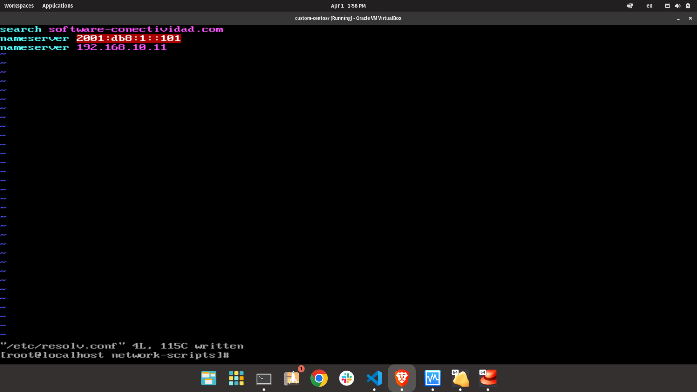
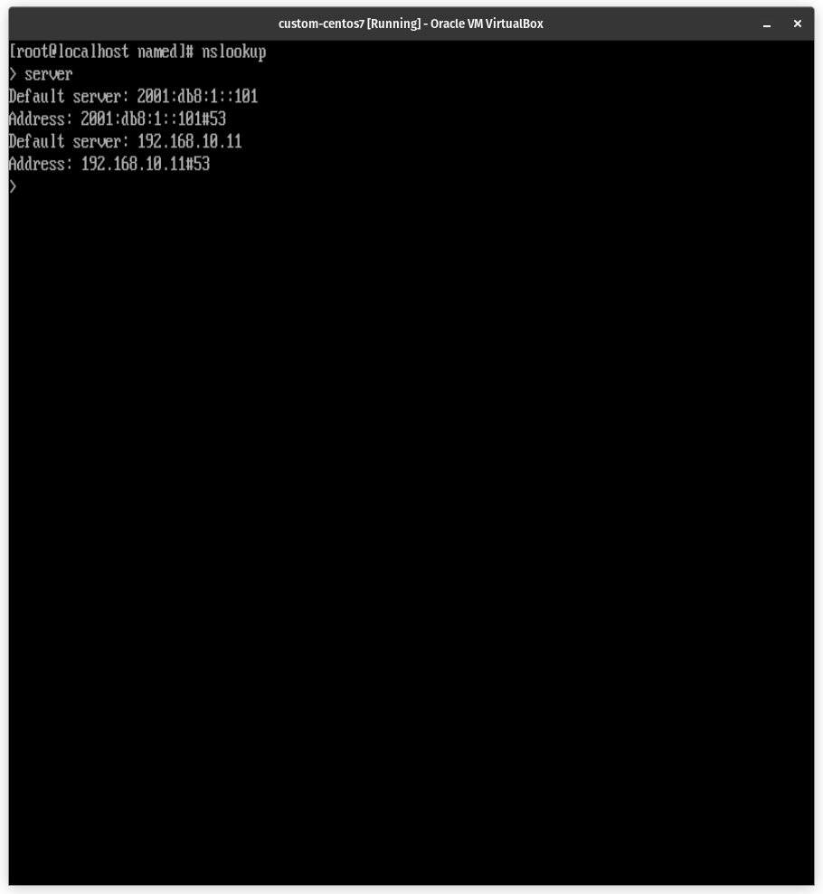

# Configuracion de un servidor DNS

Un servidor DNS (Domain Name System) es un servicio que se utiliza para traducir los nombres de dominio de sitios web en direcciones IP (Protocolo de Internet). Cuando un usuario intenta acceder a un sitio web, el navegador web envía una solicitud al servidor DNS para resolver el nombre de dominio en una dirección IP. Una vez que se ha resuelto la dirección IP, el navegador web puede conectar con el servidor web que aloja el sitio web y solicitar su contenido.

Un servidor DNS es un componente esencial de Internet que permite que los nombres de dominio se traduzcan en direcciones IP para que los usuarios puedan acceder a los sitios web. Sin un servidor DNS, los usuarios tendrían que recordar y utilizar las direcciones IP para acceder a los sitios web, lo que sería mucho más difícil que simplemente escribir un nombre de dominio fácil de recordar.

### Instalacion de paquetes

Para instalar el servidor DNS (BIND) en CentOS 7.1, ejecute el siguiente comando:

```bash
yum -y install bind bind-chroot bind-utils bind-libs caching-nameserver
```

---

### Configuracion de archivos

- Archivo de configuracion [/etc/named.conf](#etcnamedconf)
  - [_options_](#options)
  - [_logging_](#logging)
  - [Zonas IPv4](#zonas-ipv4)
    - Zona .
    - Zona para IPv4
  - [Zonas IPv6](#zonas-ipv6)
    - Zonas IPv6
- Archivo de zona directa
  - [example.com.zone](#archivo-de-zonas-directas)
- Archivos de zonas inversas
  - [192.168.10.zone](#archivo-de-zonas-inversas)
  - [2001_db8_1_0.zone](#archivo-de-zonas-inversas)

#### /etc/named.conf

El archivo `/etc/named.conf` contiene la configuracion del servidor DNS. En este archivo se especifican las zonas de DNS que el servidor maneja, asi como las opciones de configuracion del servidor.

Una muestra del archivo `/etc/named.conf` se encuentra en el siguiente archivo [named.conf](named.conf) donde se ha usado `example.com` como nombre de dominio y `192.168.10.11` y `2001:db8:1::101` como direcciones IPv4 e IPv6 del servidor DNS, respectivamente.

#### _options_

Seccion para definir las rutas de ubicación de los archivos de configuración para cada
una de las zonas.

```bash
options {
  listen-on    port 53 { 127.0.0.1; 192.168.10.11; };
  listen-on-v6 port 53 { ::1; 2001:db8:1::101; };

  directory "/var/named";
  dump-file "/var/named/data/cache_dump.db";
  statistics-file "/var/named/data/named_stats.txt";
  memstatistics-file "/var/named/data/named_mem_stats.txt";

  allow-query     { any; };

  recursion yes;
  notify yes;

  dnssec-enable yes;
  dnssec-validation yes;
  dnssec-lookaside auto;
  bindkeys-file "/etc/named.iscdlv.key";
  managed-keys-directory "/var/named/dynamic";

  pid-file "/run/named/named.pid";
  session-keyfile "/run/named/session.key";
};
```

en este caso `192.168.10.11` y `2001:db8:1::101` son las IPv4 e IPv6 del servidor DNS, respectivamente.

##### logging

Seccion para definir el nivel de log del servidor DNS.

```bash
logging {
  channel default_debug {
    file "data/named.run";
    severity dynamic;
  };
};
```

##### Zonas IPv4

Los servidores DNS basan sus configuraciones en la definición de zonas o dominios, y estos deben ser definidos inicialmente en el fichero “named.conf ”. Las siguientes configuraciones van a ser parte de dicho archivo:

- Zona `.`

```
zone "." IN {
  type hintl
  file "named.ca";
};

include "/etc/named.rfc1912.zones";
include "/etc/named.root.key";
```

- Zona para IPv4

En esta sección se definen las zonas para IPv4, también encontramos la definición para la resolución de dominios y direcciones IP tanto directas como inversas.

```
zone "example.com" IN {
    type master;
    file "example.com.zone";
};

zone "192.168.10.in-addr.arpa" {
  type master;
  file "192.168.10.zone";
};
```

donde se ha usado `example.com` como nombre de dominio y `192.168.10` como porcion de red de la IPv4 del servidor DNS.

##### Zonas IPv6

En esta sección se detallan las zonas para IPv6 y encontramos la definición para la resolución de dominios y direcciones IP tanto directas como inversas.

- Zona para IPv6

```
zone "0.0.0.0.1.0.0.0.8.b.d.0.1.0.0.2.ip6.arpa" {
  type master;
  file "2001_db8_1_0.zone";
};
```

#### Archivo de zonas directas

- Archivo [`/var/named/example.com.zone`](example.com.zone): El archivo “example.com.zone” contiene la definición del servidor DNS para la zona directa definida en el direccionamiento para IPv4 y se indica mediante el registro NS.

#### Archivo de zonas inversas

- Archivo [`/var/named/192.168.10.zone`](192.168.10.zone): El archivo “192.168.10.zone” contiene la definición del servidor DNS para la zona inversa definida en el direccionamiento para IPv4 y se indica mediante el registro NS.
- Archivo [`/var/named/2001_db8_1_0.zone`](2001_db8_1_0.zone): El archivo “2001_db8_1_0.zone” contiene la definición del servidor DNS para la zona directa definida en el direccionamiento para IPv6 y se indica mediante el registro NS.

### Verificaciones de configuracion de archivos de zona

Para verificar la sintaxis de los archivos de zona, ejecute el siguiente comando:

```bash
named-checkzone example.com example.com.zone
```

```bash
named-checkzone 192.168.10.zone
```

```bash
named-checkzone 2001_db8_1_0.zone
```

---

### Seleccion del servidor DNS

Para seleccionar el servidor DNS, se debe editar el archivo `/etc/resolv.conf` y colocar la del servidor DNS.

```bash
vim /etc/resolv.conf
```

```bash
# Generated by NetworkManager
search example.com
nameserver 2001:db8:1::101
nameserver 192.168.10.11
```



---

### Verifcacion del servidor DNS

Primero podemos reiniciar el servicio:

```
systemctl restart named
```

Para verificar que el servidor DNS esta desplegado adecuadamente, ejecute el siguiente comando:

```
netstat -tulpn | grep named
```

Para verificar el funcionamiento del servidor DNS, ejecute alguno de los siguientes comandos:

```
nslookup
  > server
```

Debe verse la configuracion del servidor DNS:



Tambien se pueden comprobar las diferentes consultas DNS con los siguientes comandos:

```bash
dig dns6.example.com AAAA
```

```bash
dig MX example.com
```

```bash
nslookup www.example.com
```

```bash
nslookup www6.example.com
```

```bash
nslookup pop6.example.com
```

```bash
nslookup imap6.example.com
```

```bash
nslookup smtp6.example.com
```

```bash
nslookup streaming6.example.com
```
