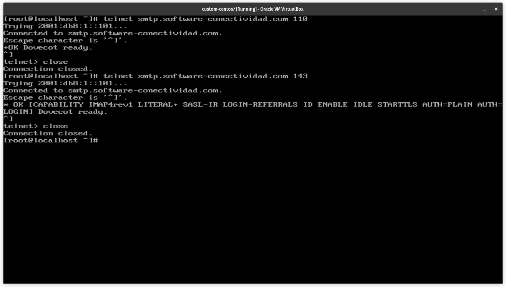

# Configuracion de un servicio Postfix

Dovecot es un servidor de correo electrónico IMAP y POP3. Dovecot es un servidor de correo electrónico de código abierto que se ejecuta en Linux y otros sistemas operativos Unix. Dovecot está diseñado para ser rápido, pequeño y fácil de configurar. Dovecot está escrito principalmente en C y se basa en el servidor de correo electrónico Courier.

### Instalacion de paquetes

Para instalar el servicio Dovecot en CentOS 7.1, ejecute el siguiente comando:

```bash
yum -y install dovecot
```

---

### Configuracion de archivos

- Archivo de configuracion general [/etc/dovecot/dovecot.conf](#etcdovecotdovecotconf).
  - [_protocols_](#etcdovecotdovecotconf)
  - [_listen_](#etcdovecotdovecotconf)
- Archivo de autenticacion [/etc/dovecot/conf.d/10-auth.conf](#etcdovecotconfd10-authconf).
  - [_disable_plaintext_auth_](#etcdovecotconfd10-authconf)
  - [_auth_mechanisms_](#etcdovecotconfd10-authconf)

#### /etc/dovecot/dovecot.conf

Dovecot tiene varios cientos de parámetros de configuración que se controlan a través del archivo `dovecot.conf`. Afortunadamente, todos los parámetros tienen valores predeterminados razonables. En muchos casos, necesita configurar solo dos o tres parámetros antes de iniciar el sistema de correo.

###### _protocols_

Directiva “protocols”: si se desea activar los servicios POP e IMAP, estos se deben indicar
en la directiva “protocols” así: Para activar los servicios POP, POP3S, IMAP e IMAPS, estos se deben indicar en la directiva
“protocols”:

```bash
protocols = imap pop3 lmtp
```

###### _listen_

Directiva Listen: esta directiva activa el servicio sobre IPv6; se puede pueden utilizar las
siguientes opciones según el protocolo que se quiera habilitar.

```bash
listen = *, ::
```

#### /etc/dovecot/conf.d/10-auth.conf

###### _disable_plaintext_auth_

Directiva “disable_plaintext_auth”: esta directiva deshabilita la autenticación en texto plano.

```bash
disable_plaintext_auth = no
```

###### _auth_mechanisms_

Directiva “auth_mechanisms”: esta directiva indica el mecanismo de autenticación que se

```bash
auth_mechanisms = plain login
```

---

### Verifcacion del servicio Dovecot

Primero debemos iniciar el servicio:

```bash
systemctl start dovecot
```

Para verificar que el servidor de correo esta desplegado adecuadamente, ejecute el siguiente comando:

```bash
netstat -tulpn | grep 143
netstat -tulpn | grep 110
```


