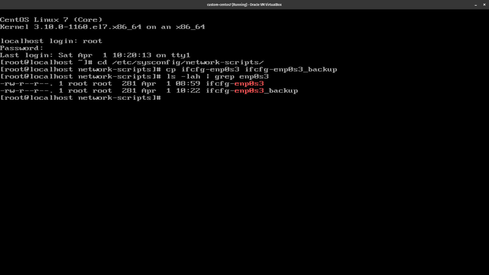

## Conexion a Internet de una maquina virtual en CentOS 7.1

Enciende tu marquina virtual e inicia sesión como root.


Desde aca, vamos al siguiente directorio:

```bash
  cd /etc/sysconfig/network-scripts
```

Primero vamos a hacer un backup de nuevo archivo `ifcfg-enp0s3`, ejecutando el siguiente comando:

```bash
  cp ifcfg-enp0s3 ifcfg-enp0s3._backup
```

Para verificar que el backup fue creado correctamente ejecutamos el siguiente comando:

```bash
  ls -lah | grep ifcfg-enp0s3
```



Ahora que tenemos el backup, vamos a editar el archivo `ifcfg-enp0s3` ejecutando:

```bash
  vi ifcfg-enp0s3
```

Actualiza las siguientes lineas:

```bash
  ONBOOT=yes
```

Ahora, vamos a configurar la puerta de enlace en el archivo `/etc/sysconfig/network`. Para hacerlo ejecutamos:

```bash
  cd /etc/sysconfig
```

Nos aseguramos de hacer un backup de nuestro archivo `network`, ejecutando:

```bash
  cp network network_backup
```

Para verificar que el backup fue creado correctamente ejecutamos el siguiente comando:

```bash
  ls -lah | grep network
```


Ahora agreamos algunas lineas al archivo `network`:

```bash
  vi network
```

Debe ser un archivo vacio, agregamos las siguientes lineas:

```bash
  NETWORKING=yes
  HOSTNAME=centos7
  GATEWAY=192.168.10.1
```

Deberia quedar coi algo como esto:


El valor de `GATEWAY` es la puerta de enlace de tu maquina host. En este caso, es `192.168.10.1`.

Ahora vamos a configurar el name servers en el archivo `/etc/resolv.conf`. Para ir a la carpeta ejecutamos:

```bash
  cd /etc
```

Como siempre, hacemos un backup del archivo `resolv.conf` ejecutando:

```bash
  cp resolv.conf resolv.conf_backup
```

Para verificar que el backup fue creado correctamente ejecutamos el siguiente comando:

```bash
  ls -lah | grep resolv.conf
```


Ahora agregamos algunas lineas al archivo `resolv.conf`:

```bash
  vi resolv.conf
```

Inicialmente debe ser un archivo vacio, agregamos las siguientes lineas:

```bash
  nameserver 8.8.8.8
  nameserver 8.8.4.4
```

Antes de continuar tenemos que asegurarnos que nuestra maquina virtual tiene el adaptador de red configurado correctamente. En este caso estamos usando el adaptador NAT Network Adapter. **Si tienes que configurarlo y tu maquina virtual esta encendida, tienes que reiniciarla**.


Ya casi estamos. Nos aseguramos de reiniciar el servicio de red ejecutando:

```bash
  systemctl restart network
```

Ahora, vamos a probar nuestra conexion a internet ejecutando:

```bash
  ping google.com
```


## Solucion de problemas

Si quieres saber cual es la ip de tu maquina virtual, ejecuta:

```bash
  ip addr
```


