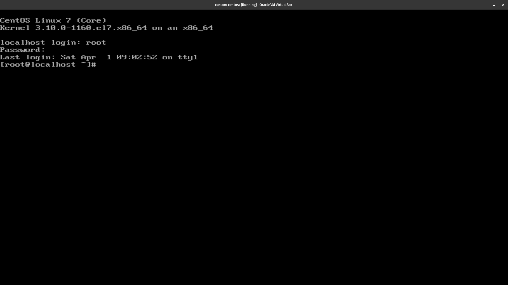
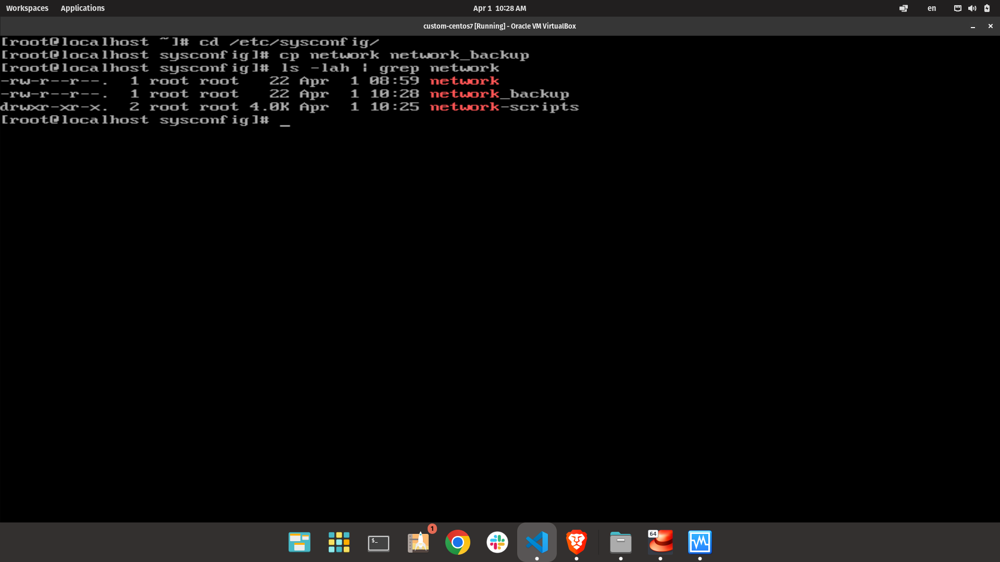

# Configurar una IP estática en CentOS 7.1

Enciende tu marquina virtual e inicia sesión como root.



Desde aca, vamos al siguiente directorio:

```bash
  cd /etc/sysconfig/network-scripts
```

En este punto debemos ajustar la configuracion de la interfaz de la tarjeta de red que usaremos para conectarnos. **En mi caso es la `enp0s3`**.

Primero vamos a hacer un backup de nuevo archivo `ifcfg-enp0s3`, ejecutando el siguiente comando:

```bash
  cp ifcfg-enp0s3 ifcfg-enp0s3._backup
```

Para verificar que el backup fue creado correctamente ejecutamos el siguiente comando:

```bash
  ls -lah | grep ifcfg-enp0s3
```


Ahora que tenemos el backup, vamos a editar el archivo `ifcfg-enp0s3` ejecutando:

```bash
  vi ifcfg-enp0s3
```

Actualiza las siguientes lineas:

```bash
  BOOTPROTO=static
  IPADDR=192.168.10.11
  IPV6ADDR=2001:db8:1::101
```

En este caso, asignamos `192.168.10.11` como IP estática y `2001:db8:1::101` como IPv6 estática.

Ahora, vamos a configurar la puerta de enlace en el archivo `/etc/sysconfig/network`. Para hacerlo ejecutamos:

```bash
  cd /etc/sysconfig
```

Nos aseguramos de hacer un backup de nuestro archivo `network`, ejecutando:

```bash
  cp network network_backup
```

Para verificar que el backup fue creado correctamente ejecutamos el siguiente comando:

```bash
  ls -lah | grep network
```



Ahora agreamos algunas lineas al archivo `network`:

```bash
  vi network
```

Debe ser un archivo vacio, agregamos las siguientes lineas:

```bash
  NETWORKING=yes
  HOSTNAME=centos7
  GATEWAY=192.168.10.1
```

Deberia quedar algo como esto:


El valor de `GATEWAY` es la puerta de enlace de tu maquina host. En este caso, es `192.168.10.1`.

Ahora, vamos a reiniciar el servicio de red para que los cambios surtan efecto:

```bash
  systemctl restart network
```

### Notas

Para comprobar cual es la ip de tu maquina virtual, ejecuta:

```bash
  ip addr
```


